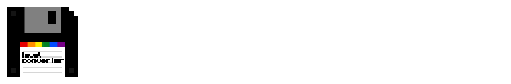

#   
Easily convert classic and indev levels  

## Dependencies  
- [Java 8 or later](https://adoptium.net/temurin/releases/?version=8). (Built using Eclipse Temurin 8.0.412+8)  

## Attributions  
- [ClassicExplorer](https://github.com/bluecrab2/ClassicExplorer).  
    - We include some code from ClassicExplorer with permission from bluecrab2 for our classic converter.  

## Contact  
If you want to report a bug, you can use the [Issues](https://github.com/mclegoman/mclm_save/issues) page, be sure to specify which version you are using and describe how the bug occurred and what the bug does.  
For any other inquires, either email me at [`taylor@mclegoman.com`](mailto://taylor@mclegoman.com), or send me a message on Discord `@legotaylor`.  

##  
Licensed under LGPL-3.0-or-later.  

**Level Converter is not affiliated with/endorsed by Mojang Studios or Microsoft.**  
[Minecraft](https://minecraft.net/) is a trademark of Microsoft Corporation.  
